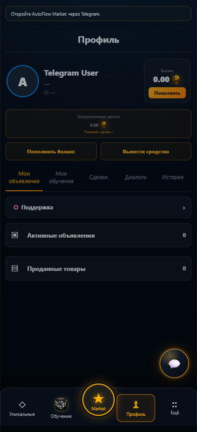
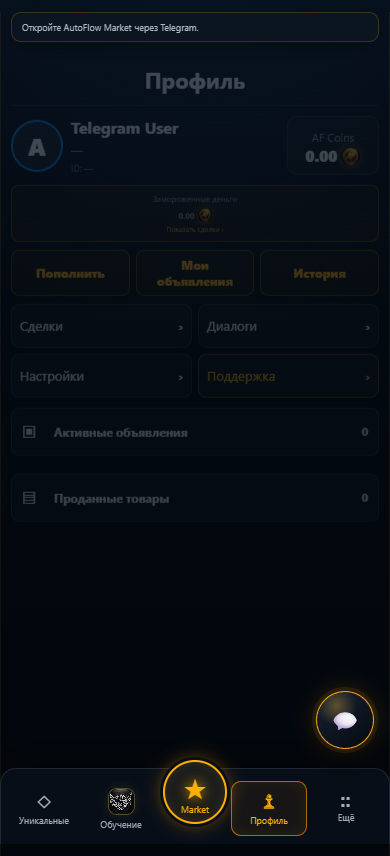
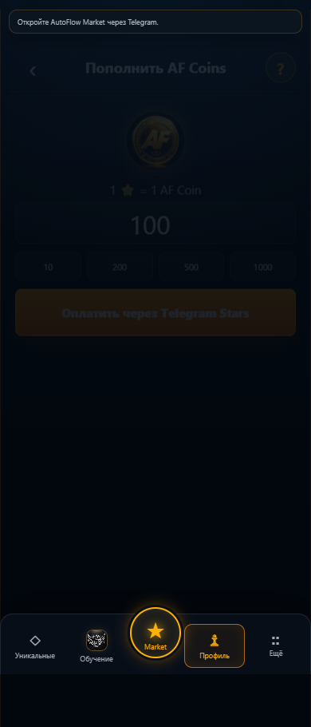
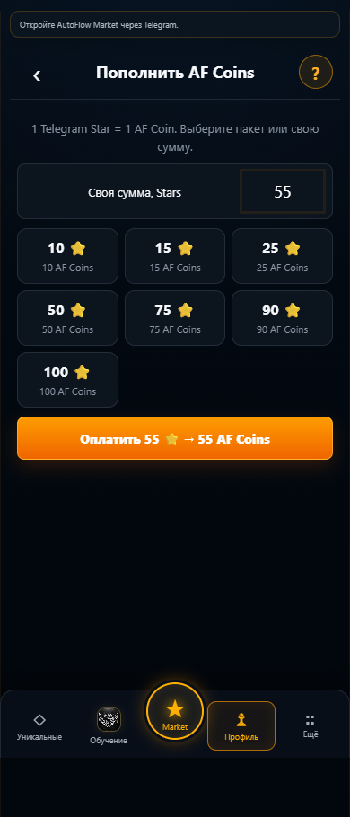
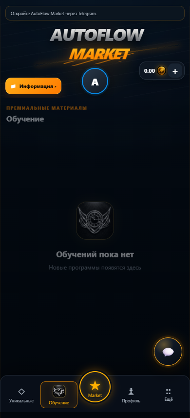
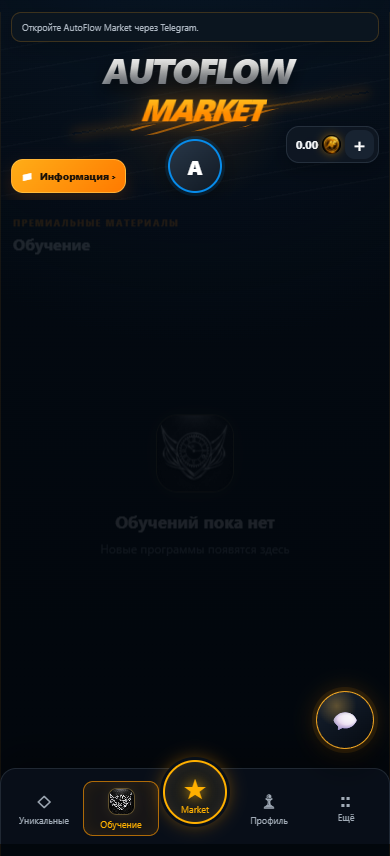
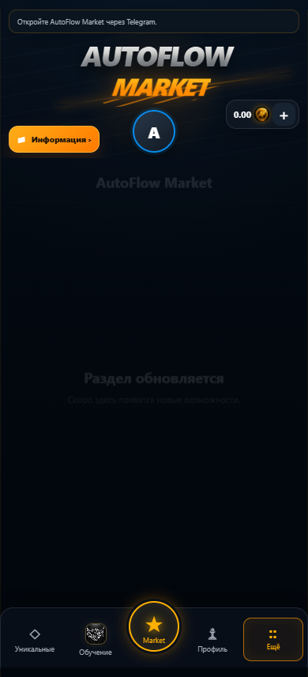
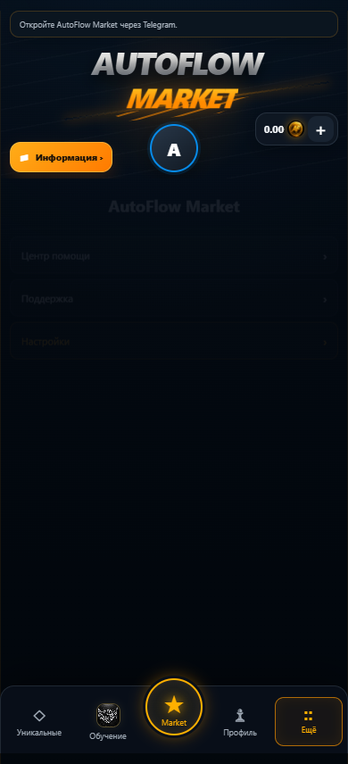

# Компактный UX: помощь, пополнение, обучение, профиль

## Исправлено

- Купленные курсы открываются через заказ, а не через публичную страницу продукта, которая возвращает 404 после снятия курса с продажи.
- «Ещё» больше не является заглушкой: доступны помощь, поддержка и настройки.
- В профиле нет отдельного пункта «Мои обучения»; покупки находятся внутри «Обучение».
- Последовательные ответы optional API группируют перерисовку в один animation frame. Быстрый ответ не ждёт самого медленного запроса. Переходы в основные разделы загружают только нужные им ресурсы, а не весь маркетплейс.
- При обновлении профиля баланс синхронизируется с полученным серверным wallet, без локального начисления.

## Добавлено

- Help Center: 11 статей, пять якорных ссылок, шаги, предупреждения, рабочие переходы. Для скриншотов предусмотрено опциональное поле image (src/alt/width/height), lazy loading и async decoding. Изображения статей не выдумывались и не подменяются скриншотами чужих аккаунтов.
- Пакеты 10/15/25/50/75/90/100 Stars с выбором и общей кнопкой оплаты; собственная сумма сохранена. Курс 1:1 проверен в серверном обработчике `star_payment_credit` (`amount = money(xtr_amount)`).
- После серверного paid: подтверждение, актуальный баланс, «Готово», переход в историю. Pending/error/retry/cancelled сохранены. Финансовые POST и shortfall flow не переписаны.
- Страница купленного обучения с данными PostgreSQL. Автоматический курс: перечень материалов, открытие чата с ботом, отдельная повторная выдача с существующим cooldown/lock. Открытие чата само по себе не отправляет материалы повторно.
- Персональное обучение: реальный username преподавателя из записи seller, личный Telegram-чат, без создания deal chat. При отсутствии корректного username — поддержка и номер заказа, не фиктивная ссылка.
- Компактные профиль и пополнение, отдельный admin-only блок, lazy loading обложек, сохранены safe area и shared Back.
- Настройки используют Telegram как источник имени/фото/темы; доступно обновление серверных данных профиля и существующий вывод средств. Искусственные переключатели не добавлялись.

## Изменения БД

Нет. Миграции не нужны. Текущий Alembic head: `0036_inactivity_state`. Пользователи, объявления, кошельки, покупки и история не удалялись.

## Изменения API

- `GET /api/training/purchases/{purchase_id}/access` — только покупатель заказа. Возвращает историю покупки, описание и разрешённый контакт; работает для скрытого/архивного продукта. Чужой/несуществующий заказ: 404.
- `GET /api/training/purchases/{purchase_id}/materials/open` — только владелец paid/completed automatic-покупки. Возвращает каноническую ссылку на существующего бота. Чужая/неподходящая покупка: 404. Ошибки Bot API не превращаются в успех.
- `delivery_reference`/Telegram `file_id` не включаются в buyer API. Публичные training API не расширены закрытыми материалами.
- Покупка, Stars webhook, settlement, refund, уведомления и worker не изменены.

## Что протестировано

- Backend: `python -m pytest -q` — 248 passed. Три новых теста с реальными SQLAlchemy-моделями/SQLite: сохранённая архивная покупка, реальный владелец контакта и отсутствие username, запрет чужого/несуществующего заказа, запрет материалов персонального заказа, отсутствие закрытого delivery reference.
- Frontend: `node --test webapp/tests/*.test.cjs` — 80 passed. Новые проверки Help Center, пакетов, библиотеки и выполнения coalesced render; старые тесты обновлены только под явно изменённые требования.
- `node webapp/tests/compact-ux-browser.cjs` — 320/360/390/430 px, MS Edge/Playwright. Реальный статический frontend без fake users/balances/API success. Проверены помощь и якоря, профиль/обучение/Ещё, пакеты, своя сумма, 44px кнопки, отсутствие горизонтального переполнения и JS exceptions, отсутствие ложного успеха оплаты вне Telegram.
- `node webapp/tests/navigation-browser.cjs` — прежний изолированный регрессионный harness с API/Telegram fixtures: четыре ширины, safe areas, уменьшенная высота чата, deep link, read cursor, badge, double back. Это НЕ живой Telegram E2E.
- JavaScript syntax, `git diff --check`, single Alembic head. Существующий build script обновляет content version всех frontend assets.

## Что пока не работает / не подтверждено

- Полный пользовательский E2E в настоящем Telegram **не выполнен**: в этой среде нет двух тестовых Telegram-аккаунтов, реальных iPhone/Android и тестового Railway/PostgreSQL окружения. Не подтверждены здесь живые Stars, фактическая выдача файлов ботом, доставка уведомлений и поведение клавиатуры Telegram на устройстве.
- Ссылка «Открыть материалы» ведёт в чат выдающего бота, а не на конкретное отправленное сообщение: существующая система не сохраняет message_id выдачи. Новый проигрыватель/хранилище не создавались.
- Без username преподавателя прямой личный Telegram-переход отсутствует; работает путь через поддержку. Внутренний чат сделки для обучения не создаётся.
- Информационные скриншоты самих статей можно добавить через предусмотренный image descriptor; сейчас инструкции текстовые.

## Какие риски остались

- До merge/release требуется staging-приёмка двумя Telegram-пользователями: реальная авторизация, покупка автомобиля/обучения, Stars pending→paid, обновление кошелька и истории, возврат, unread и таймер неактивности после restart. SQLite и fixtures не доказывают PostgreSQL row locking или доставку Telegram.
- Для личного контакта и открытия материалов нужна доступность Telegram/бота. Ошибка возвращается пользователю; деньги не изменяются этими GET.
- Обновление backend и frontend требуется в одном deployment: старая версия backend не содержит двух новых маршрутов.
- Ни production deploy, ни изменения рабочей БД, ни реальные денежные/ботовые операции при локальной проверке не выполнялись. PR оставлен draft до живой приёмки.

## Скриншоты before / after

Это реальные скриншоты локального frontend **без авторизации**, не симуляция действующих пользователей. Приглушённые элементы — существующее ограничение режима вне Telegram. Они показывают вёрстку, но не доказывают работу платежей или заказов.

| Экран, 390 px | До | После |
| --- | --- | --- |
| Профиль |  |  |
| Пополнение |  |  |
| Обучение |  |  |
| Ещё |  |  |

Новый [Help Center](ux-after-help.png).

## Изменённые файлы

- `backend/app/routes.py` — два авторизованных read-only маршрута библиотеки.
- `backend/tests/test_training_purchase_access_db.py` — новые DB-backed тесты.
- `webapp/index.html`, `webapp/css/style.css`, `webapp/js/app.js` — перечисленный UX, навигация, рендеринг.
- `webapp/index.html` содержит новый content build version; `webapp/build-info.json` генерируется существующим build script и по правилам репозитория не хранится в Git.
- `webapp/tests/compact-ux.test.cjs`, `webapp/tests/compact-ux-browser.cjs` — новые проверки.
- `webapp/tests/bootstrap.test.cjs`, `content-badges.test.cjs`, `training.test.cjs`, `ux-navigation-history.test.cjs` — актуализированные ожидания.
- Этот отчёт и `docs/ux-before-*.png`, `docs/ux-after-*.png` — визуальные материалы для ревью.
